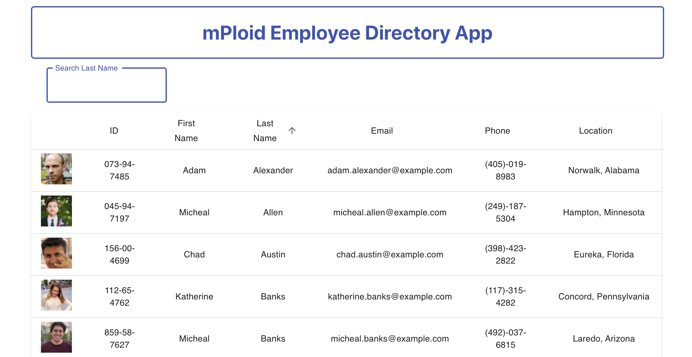

# mPloid-React-Employee-Directory
Find folks fast with mPloid, an employee directory powered by React!

[You can view the deployed app here:](https://keiththarp.github.io/mPloid-React-Employee-Directory/ "View mPloid App") https://balance-is-key.herokuapp.com/

## Table of Contents
- [Usage](#How-to-use)
- [Technologies](#Languages-and-Lessons)
- [Contribute](#How-to-contribute)
- [Questions](#Developed-by)
- [Credits](#Acknowledgments-and-Credits)
- [License](#Licensed-under-MIT)

## How to use
The app is very easy to use. Head to https://keiththarp.github.io/mPloid-React-Employee-Directory/, for a demo.

## Technologies
 - Node.js
 - React
 - Express
 - Material-UI

The exercises in this project focussed on learning React 

## How to contribute
If anyone would like to improve the app by contributing, they're welcome to fork it and submit a pull request on [GitHub](https://github.com/keiththarp/Mongo-Workout-Watcher).

## Developed by
- [Keith Tharp](https://github.com/keiththarp)

Please reach out with questions at:
  - keithstharp@gmail.com

Find more of Keith Tharp's work at:
  - https://github.com/keiththarp

## Acknowledgments and Credits
Thank you to all my fellow students and study groups that helped and supported with this homework project!

## Licensed under MIT
[Click here for more information on the MIT license.](https://choosealicense.com/licenses/mit/)

